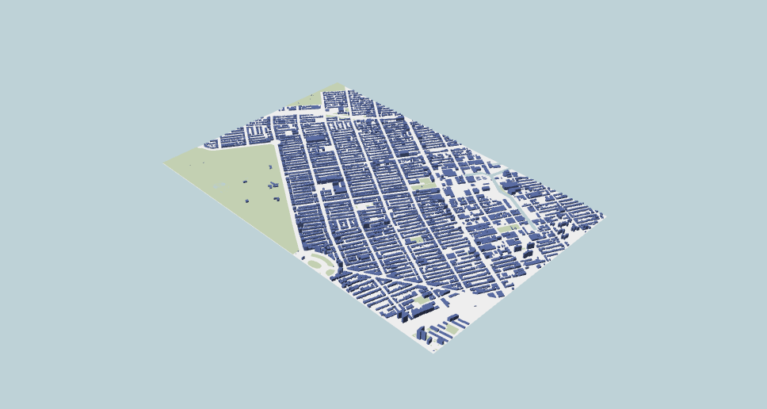
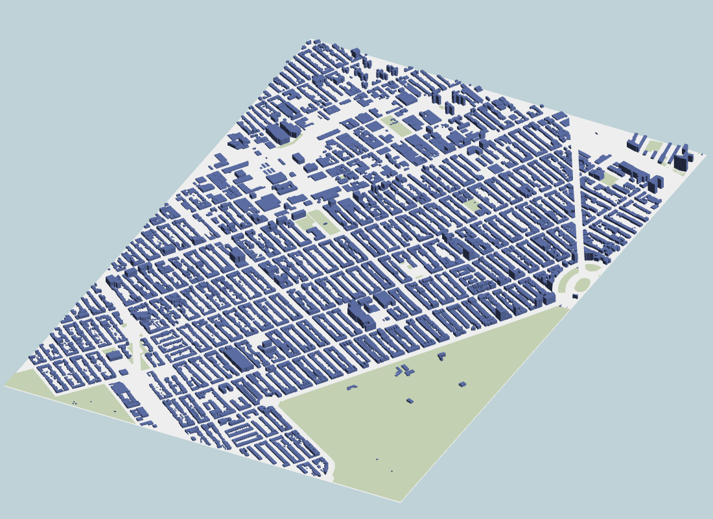
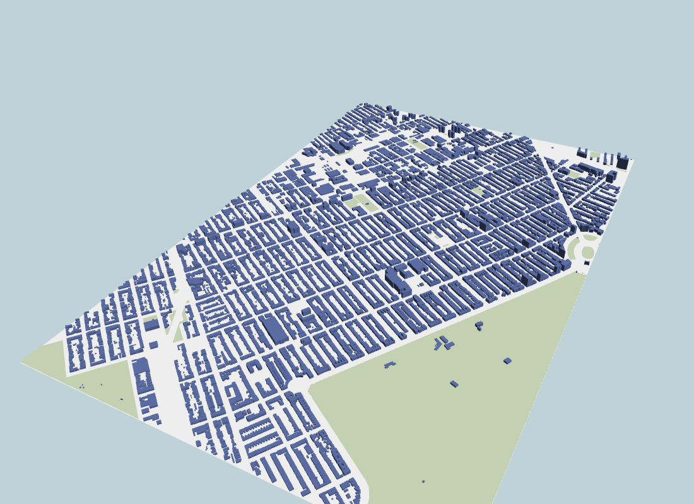

#Computer Graphics

## *HOW TO RUN* ##

## STEP 1# #
*TO RUN THE CODE USE THE COMMAND "python -m SimpleHTTPServer"*

## STEP 2 #
*Open the server created on localhost:8000*


developed an application to render an urban setting described in an external JSON file that must be uploaded by the user through a configuration panel. The JSON file has four layers describing the elements and color of buildings, parks, water and surface of a particular region (see below for a complete description of the file). You should use a unique buffer and VAO for *each* layer.

There are five parts. 
- `FlatProgram`: handles shading of flat layers (water, parks, surface). These layers do not contain normals (as you can notice in the file description below), so they have to be shaded by a constant color. The color of each layer is also specified in the JSON file.
- `BuildingProgram`: handles shading of building layer. This layer contains normals and a constant color, so use this information to shade the side of the buildings accordingly. You do not have to implement any illumination model, it is enough to simply color the side of the buildings based on the layer color and the angle between a direction of your choosing and the face of the building.
- `Layer` and `BuildingLayer`: handles flat layers, and building layer.
- `Layers`: collection of layers.

File `utils.js` contains some useful functions to create [shaders](https://developer.mozilla.org/en-US/docs/Web/API/WebGLShader), [programs](https://developer.mozilla.org/en-US/docs/Web/API/WebGLProgram), [buffers](https://developer.mozilla.org/en-US/docs/Web/API/WebGLBuffer), [VAOs](https://developer.mozilla.org/en-US/docs/Web/API/WebGLVertexArrayObject), as well as [matrix operations](https://developer.mozilla.org/en-US/docs/Web/API/WebGL_API/Matrix_math_for_the_web), [projections](http://www.songho.ca/opengl/gl_projectionmatrix.html), and [lookat](https://www.khronos.org/registry/OpenGL-Refpages/gl2.1/xhtml/gluLookAt.xml).


Created a configuration panel with four components: 
1) A [dropdown](https://developer.mozilla.org/en-US/docs/Web/HTML/Element/option) menu with values *perspective* and *orthographic*. Changing the selected option changes the projection type.
2) A file [input](https://developer.mozilla.org/en-US/docs/Web/HTML/Element/input/file) element responsible for loading a JSON file (see Task 3).

Created functionalities to handle mouse input. In other words, as the user clicks and moves the mouse around the canvas, I handle the appropriate events (see [here](https://developer.mozilla.org/en-US/docs/Web/API/MouseEvent)) and update two variables: one storing the horizontal mouse movement and another one storing the vertical mouse movement. Ensuring that both variables are constrained to the ranges: 0-360, and 1-100. 

Connected the file input element to the `window.handleFile` function so that every time a JSON file is uploaded by the user, `window.handleFile` is called. it  also complete the `window.handleFile` function so that it properly parses the JSON file, and adds the appropriate layer to the layers dictionary. In order to handle layers, I implemented the `init` and `draw` functions in `Layer` and `BuildingLayer`.

implemented a view transformation matrix inside `updateViewMatrix` in such a way that when the user drags the mouse (see Task 2), the camera rotates around the centerpoint of the layers. The initial position of the camera should be similar to the image below:



#### Task 5
You should implement two types of projections (orthographic and perspective). This should be handled by function `updateProjectionMatrix`. Notice that even in an orthographic projection you should be able to zoom-in and zoom-out towards the centerpoint of the model (computed inside `getCentroid`).

<p align="center">
 
</p>

#### JSON format

The JSON file contains coordinates, indices, and colors for 4 layers (buildings, water, parks, surface). The building layer also contains normals for each vertex. You can download a zip file with a sample json [here](https://fmiranda.me/courses/cs425-spring-2021/city.json.zip).

The `coordinates` array consists of a list of all the vertices for that particular layer. The `indices` array contains the indices of the vertices used to render triangles via `glDrawElements`. That is, starting from the first element in the indices array, every three values correspond to indices of vertices that make a triangle in the triangle mesh.

```javascript
{
    'buildings': 
    {
        'coordinates': [x_1,y_1,z_1,x_2,y_2,z_2,...,x_n,y_n,z_n],
        'indices': [i_1,i_2,...,i_n],
        'normals': [x_1,y_1,z_1,x_2,y_2,z_2,...,x_n,y_n,z_n],
        'color': [r,g,b,a]
    },
    'water': 
    {
        'coordinates': [x_1,y_1,z_1,x_2,y_2,z_2,...,x_n,y_n,z_n],
        'indices': [i_1,i_2,...,i_n],
        'color': [r,g,b,a]
    },
    'parks': 
    {
        'coordinates': [x_1,y_1,z_1,x_2,y_2,z_2,...,x_n,y_n,z_n],
        'indices': [i_1,i_2,...,i_n],
        'color': [r,g,b,a]
    },
    'surface':
    {
        'coordinates': [x_1,y_1,z_1,x_2,y_2,z_2,...,x_n,y_n,z_n],
        'indices': [i_1,i_2,...,i_n],
        'color': [r,g,b,a]
    },
}
```
